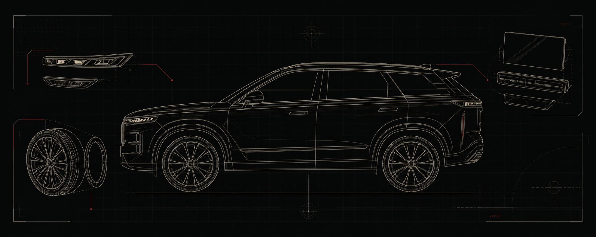

<p align="center">
  <picture>
    <source media="(prefers-color-scheme: dark)" srcset="docs/assets/sureizu-mark-light.png">
    <source media="(prefers-color-scheme: light)" srcset="docs/assets/sureizu-mark-dark.png">
    
  </picture>
</p>

<h1 align="center">J7 WEB INSTALLER</h1>

<p align="center">
  Direct APK deployment from an Android phone to a DesaySV infotainment system.<br>
  No laptop. No cloud upload. No replacement firmware.
</p>

<p align="center">
  <a href="https://muteki-met.github.io/j7-web-installer/?v=120"><strong>OPEN INSTALLER ↗</strong></a>
  &nbsp;·&nbsp;
  <a href="https://muteki-met.github.io/j7-web-installer/J7Probe-0.2.apk">DOWNLOAD J7 PROBE 0.2</a>
</p>


## BROWSER → USB → CAR

J7 Web Installer transfers an APK directly from Chrome on Android to the infotainment unit over WebUSB and ADB. The file never passes through an application server.

| 01 · Connect | 02 · Select | 03 · Install |
|:--|:--|:--|
| Connect the phone with a USB OTG adapter and approve debugging on the car display. | Choose a single APK stored on the phone. | Deploy it through the DesaySV package-manager flow. |

> [!IMPORTANT]
> Park the vehicle before using the installer. Install only APKs you trust. Do not remove or replace factory packages.

## REQUIREMENTS

- Android phone with Chrome and WebUSB support
- USB OTG adapter and a data-capable cable
- USB debugging enabled on the infotainment system
- Any other ADB application fully closed

Tested on a Jaecoo J7 PHEV Exclusive running software `02.00.07`, Android 11 / API 30 and a DesaySV head unit. Other vehicles or software versions are not confirmed.



## HOW IT WORKS

```text
Android phone
    └── Chrome / WebUSB
          └── ADB transport
                └── /sdcard/Download
                      └── Android Package Manager
```

The installer uploads the selected file to the car's download directory, runs the compatible staged Package Manager command, and reports the unmodified result. It does not flash firmware, modify the launcher, or overwrite factory applications.

## LOCAL BUILD

```sh
npm install
npm run build
```

The static site is generated in `dist/` and requires HTTPS when deployed because WebUSB is available only in a secure browser context.

## DISCLAIMER

This is an independent community project and is not affiliated with or endorsed by Jaecoo, Chery, DesaySV, or their partners. You are responsible for the software installed on your vehicle.

<p align="center"><sub>DESIGNED BY SUREIZU · BUILT FOR CONTROL</sub></p>
